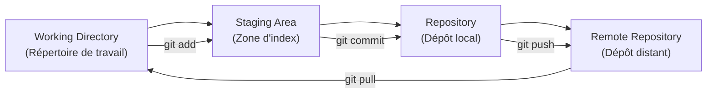

# Module 1 : Introduction à Git & GitFlow

## 📚 Objectifs pédagogiques

À la fin de ce module, vous serez capable de :
- Comprendre les concepts fondamentaux du versioning avec Git
- Utiliser les commandes Git de base pour gérer vos projets
- Appliquer la méthodologie GitFlow pour organiser votre travail en équipe
- Créer et gérer des branches pour différentes fonctionnalités
- Résoudre les conflits de merge simples

---

## 🎯 Introduction

Git est un système de contrôle de version distribué qui permet de suivre les modifications de vos fichiers au fil du temps. Imaginez-le comme un "historique détaillé" de votre projet qui vous permet de :
- Revenir à une version antérieure
- Collaborer avec d'autres développeurs
- Gérer plusieurs versions de votre code simultanément

GitFlow est une méthodologie qui définit comment organiser les branches Git dans un projet professionnel.

---

## 🔑 Concepts fondamentaux

### Qu'est-ce qu'un dépôt (Repository) ?
Un **dépôt** est un dossier qui contient votre projet et tout l'historique des modifications. Il existe en deux versions :
- **Local** : sur votre ordinateur
- **Distant** (Remote) : sur un serveur (GitHub, GitLab, etc.)

### Les zones de Git



1. **Working Directory** : Vos fichiers actuels
2. **Staging Area** : Les modifications prêtes à être sauvegardées
3. **Repository** : L'historique des versions sauvegardées
4. **Remote Repository** : Le dépôt partagé en ligne

---

## 🛠️ Commandes Git essentielles

### Configuration initiale
```bash
# Configurer votre identité (à faire une seule fois)
git config --global user.name "Votre Nom"
git config --global user.email "votre.email@example.com"

# Vérifier la configuration
git config --list
```

### Initialiser un projet
```bash
# Créer un nouveau dépôt Git
git init

# Cloner un dépôt existant
git clone https://github.com/utilisateur/nom-du-repo.git
```

### Cycle de base du versioning
```bash
# 1. Vérifier l'état de vos fichiers
git status

# 2. Ajouter des fichiers à la staging area
git add nom-du-fichier.txt    # Un fichier spécifique
git add .                     # Tous les fichiers modifiés

# 3. Créer un commit (sauvegarde)
git commit -m "Description claire de ce qui a été modifié"

# 4. Envoyer vers le dépôt distant
git push origin main
```

### Gérer l'historique
```bash
# Voir l'historique des commits
git log
git log --oneline    # Version condensée

# Voir les différences
git diff                    # Modifications non indexées
git diff --staged          # Modifications dans la staging area
```

---

## 🌳 Introduction à GitFlow

GitFlow définit une structure de branches standardisée pour organiser le développement :

```mermaid
gitgraph
    commit id: "Initial"
    branch develop
    checkout develop
    commit id: "Setup"
    
    branch feature/login
    checkout feature/login
    commit id: "Add login form"
    commit id: "Add validation"
    
    checkout develop
    merge feature/login
    commit id: "Merge login feature"
    
    branch release/v1.0
    checkout release/v1.0
    commit id: "Prepare release"
    commit id: "Fix bugs"
    
    checkout main
    merge release/v1.0
    commit id: "Release v1.0"
    
    checkout develop
    merge release/v1.0
```

### Les branches principales

1. **main/master** : Code en production, toujours stable
2. **develop** : Branche de développement, intégration des nouvelles fonctionnalités

### Les branches de support

3. **feature/** : Développement de nouvelles fonctionnalités
4. **release/** : Préparation d'une nouvelle version
5. **hotfix/** : Corrections urgentes en production

---

## 🎯 Workflow GitFlow détaillé

### 1. Développer une nouvelle fonctionnalité

```bash
# Se positionner sur develop
git checkout develop
git pull origin develop

# Créer une branche feature
git checkout -b feature/nom-de-la-fonctionnalite

# Développer et commiter
git add .
git commit -m "Implémentation de la fonctionnalité X"

# Pousser la branche
git push origin feature/nom-de-la-fonctionnalite
```

### 2. Terminer une fonctionnalité

```bash
# Revenir sur develop
git checkout develop

# Merger la feature
git merge feature/nom-de-la-fonctionnalite

# Supprimer la branche locale
git branch -d feature/nom-de-la-fonctionnalite

# Supprimer la branche distante
git push origin --delete feature/nom-de-la-fonctionnalite
```

### 3. Préparer une release

```bash
# Créer une branche release depuis develop
git checkout develop
git checkout -b release/v1.2.0

# Effectuer les derniers ajustements
git add .
git commit -m "Bump version to 1.2.0"

# Merger dans main
git checkout main
git merge release/v1.2.0

# Taguer la version
git tag -a v1.2.0 -m "Version 1.2.0"

# Merger dans develop
git checkout develop
git merge release/v1.2.0
```

---

## 🔥 Gestion des conflits

Les conflits arrivent quand deux personnes modifient la même ligne de code :

```bash
# Lors d'un merge, si conflit :
git status    # Voir les fichiers en conflit

# Éditer les fichiers et résoudre manuellement
# Rechercher les marqueurs : <<<<<<<, =======, >>>>>>>

# Une fois résolu :
git add fichier-resolu.txt
git commit -m "Résolution du conflit"
```

### Exemple de conflit dans un fichier :
```
<<<<<<< HEAD
const message = "Hello World!";
=======
const message = "Bonjour le monde!";
>>>>>>> feature/french-translation
```

---

## 📚 Ressources officielles

- [Documentation Git officielle](https://git-scm.com/doc)
- [GitFlow - Guide original](https://nvie.com/posts/a-successful-git-branching-model/)
- [GitHub Guides](https://guides.github.com/)
- [Atlassian Git Tutorials](https://www.atlassian.com/git/tutorials)

---

## 🎯 Exercices pratiques

### Exercice 1 : Premier dépôt Git
1. Créez un nouveau dossier `mon-premier-projet`
2. Initialisez Git dans ce dossier
3. Créez un fichier `README.md` avec une description du projet
4. Ajoutez et commitez ce fichier
5. Vérifiez l'historique avec `git log`

### Exercice 2 : Gestion des branches
1. Créez une branche `feature/header`
2. Ajoutez un fichier `header.html` avec du contenu HTML simple
3. Commitez vos modifications
4. Revenez sur la branche `main`
5. Mergez la branche `feature/header`
6. Supprimez la branche feature

### Exercice 3 : Simulation GitFlow
1. Créez une branche `develop` depuis `main`
2. Créez une branche `feature/navigation` depuis `develop`
3. Ajoutez un fichier `nav.css` avec quelques styles
4. Mergez cette feature dans `develop`
5. Créez une branche `release/v1.0` depuis `develop`
6. Ajoutez un fichier `VERSION` avec le numéro de version
7. Mergez la release dans `main` et `develop`

### Exercice 4 : Résolution de conflit
1. Créez deux branches depuis `main` : `feature/title1` et `feature/title2`
2. Dans chaque branche, modifiez la même ligne du fichier `README.md`
3. Mergez d'abord `feature/title1` dans `main`
4. Essayez de merger `feature/title2` et résolvez le conflit

---

## ✅ Points clés à retenir

- **Git sauvegarde l'historique** de votre projet
- **Trois zones** : Working Directory → Staging → Repository
- **GitFlow structure** le travail en équipe avec des branches spécialisées
- **Les conflits** se résolvent manuellement en éditant les fichiers
- **Commitez souvent** avec des messages descriptifs
- **Testez avant de merger** pour éviter les bugs

---

*Prochaine étape : Module 2 - Docker pour la conteneurisation de vos applications* 