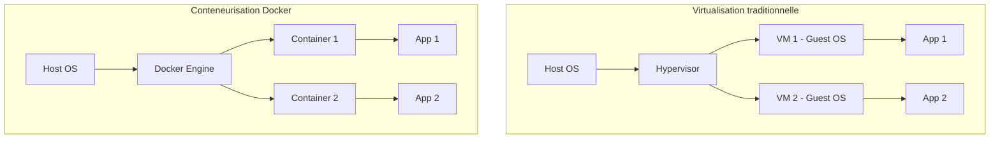
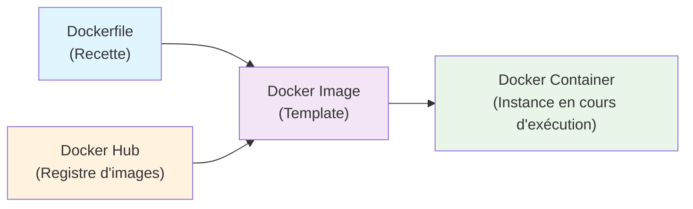
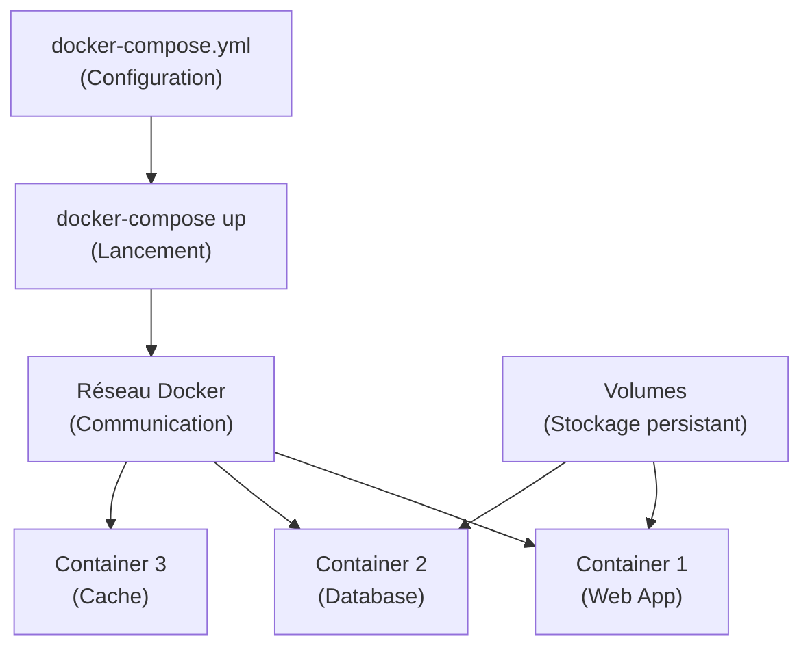
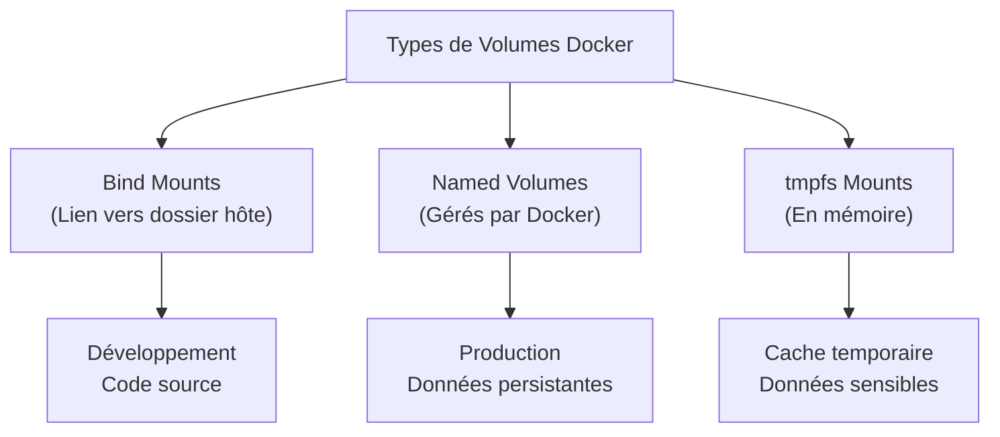

# Module 2 : Introduction à Docker

## 📚 Objectifs pédagogiques

À la fin de ce module, vous serez capable de :
- Comprendre les concepts de conteneurisation et virtualisation
- Installer et configurer Docker sur votre machine
- Créer et gérer des conteneurs Docker
- Écrire des Dockerfiles pour packager vos applications
- Utiliser Docker Compose pour orchestrer plusieurs services
- Partager vos images via Docker Hub

---

## 🎯 Introduction

Docker est une plateforme de conteneurisation qui permet d'empaqueter une application avec toutes ses dépendances dans un "conteneur" portable. 

**Analogie** : Imaginez Docker comme un système de containers de transport maritime :
- Votre application = la marchandise
- Le conteneur Docker = le container standardisé
- N'importe quel ordinateur = le navire qui peut transporter le container

**Avantages** :
- ✅ "Ça marche sur ma machine" → "Ça marche partout"
- ✅ Installation simplifiée des dépendances
- ✅ Isolation des applications
- ✅ Déploiement cohérent entre développement et production

---

## 🔑 Concepts fondamentaux

### Virtualisation vs Conteneurisation



### Architecture Docker



### Terminologie essentielle

- **Image** : Template en lecture seule (comme un ISO)
- **Conteneur** : Instance en cours d'exécution d'une image
- **Dockerfile** : Fichier de configuration pour créer une image
- **Registre** : Dépôt d'images (Docker Hub, AWS ECR, etc.)
- **Volume** : Stockage persistant partagé avec l'hôte

---

## 🛠️ Installation et configuration

### Installation sur différents OS

**Windows/Mac** :
1. Téléchargez Docker Desktop depuis [docker.com](https://www.docker.com/products/docker-desktop)
2. Suivez l'assistant d'installation
3. Redémarrez votre machine

**Linux (Ubuntu)** :
```bash
# Mise à jour du système
sudo apt update

# Installation des prérequis
sudo apt install apt-transport-https ca-certificates curl software-properties-common

# Ajout de la clé GPG Docker
curl -fsSL https://download.docker.com/linux/ubuntu/gpg | sudo apt-key add -

# Ajout du dépôt Docker
sudo add-apt-repository "deb [arch=amd64] https://download.docker.com/linux/ubuntu $(lsb_release -cs) stable"

# Installation de Docker
sudo apt update
sudo apt install docker-ce

# Ajouter votre utilisateur au groupe docker
sudo usermod -aG docker $USER
```

### Vérification de l'installation
```bash
# Vérifier la version
docker --version

# Tester avec l'image hello-world
docker run hello-world

# Voir les informations système
docker info
```

---

## 🐳 Commandes Docker essentielles

### Gestion des images
```bash
# Lister les images locales
docker images
docker image ls

# Télécharger une image
docker pull ubuntu:20.04
docker pull nginx:latest

# Supprimer une image
docker rmi nom_image:tag
docker image rm nom_image:tag

# Construire une image depuis un Dockerfile
docker build -t mon-app:1.0 .
```

### Gestion des conteneurs
```bash
# Lancer un conteneur
docker run nginx                    # Premier plan
docker run -d nginx                 # Arrière-plan (detached)
docker run -d -p 8080:80 nginx     # Avec mapping de port
docker run -it ubuntu:20.04 bash   # Mode interactif

# Lister les conteneurs
docker ps           # En cours d'exécution
docker ps -a        # Tous (y compris arrêtés)

# Arrêter/démarrer un conteneur
docker stop conteneur_id
docker start conteneur_id
docker restart conteneur_id

# Supprimer un conteneur
docker rm conteneur_id
docker rm -f conteneur_id    # Forcer la suppression

# Exécuter une commande dans un conteneur en cours
docker exec -it conteneur_id bash
```

### Informations et logs
```bash
# Voir les logs d'un conteneur
docker logs conteneur_id
docker logs -f conteneur_id    # Mode suivi

# Inspecter un conteneur
docker inspect conteneur_id

# Statistiques en temps réel
docker stats
```

---

## 📝 Création d'un Dockerfile

Un Dockerfile est un fichier texte contenant les instructions pour construire une image.

### Structure de base
```dockerfile
# Image de base
FROM ubuntu:20.04

# Métadonnées
LABEL maintainer="votre.email@example.com"
LABEL version="1.0"
LABEL description="Mon application web"

# Variables d'environnement
ENV NODE_ENV=production
ENV PORT=3000

# Répertoire de travail
WORKDIR /app

# Copier les fichiers
COPY package.json .
COPY src/ ./src/

# Installer les dépendances
RUN apt-get update && \
    apt-get install -y nodejs npm && \
    npm install && \
    apt-get clean && \
    rm -rf /var/lib/apt/lists/*

# Exposer un port
EXPOSE 3000

# Utilisateur non-root (sécurité)
RUN useradd -m appuser
USER appuser

# Commande par défaut
CMD ["node", "src/app.js"]
```

### Instructions principales

| Instruction | Description | Exemple |
|-------------|-------------|---------|
| `FROM` | Image de base | `FROM node:16-alpine` |
| `WORKDIR` | Répertoire de travail | `WORKDIR /app` |
| `COPY` | Copier fichiers locaux | `COPY . .` |
| `ADD` | Copier + décompresser | `ADD archive.tar.gz /tmp/` |
| `RUN` | Exécuter commande (build) | `RUN npm install` |
| `CMD` | Commande par défaut | `CMD ["npm", "start"]` |
| `ENTRYPOINT` | Point d'entrée fixe | `ENTRYPOINT ["docker-entrypoint.sh"]` |
| `EXPOSE` | Port documenté | `EXPOSE 80` |
| `ENV` | Variable d'environnement | `ENV NODE_ENV=production` |
| `VOLUME` | Point de montage | `VOLUME ["/data"]` |

### Exemple concret : Application Node.js
```dockerfile
# Utiliser l'image officielle Node.js
FROM node:16-alpine

# Créer le répertoire de l'application
WORKDIR /usr/src/app

# Copier les fichiers de dépendances
COPY package*.json ./

# Installer les dépendances
RUN npm ci --only=production

# Copier le code source
COPY . .

# Créer un utilisateur non-root
RUN addgroup -g 1001 -S nodejs
RUN adduser -S nodejs -u 1001

# Changer de propriétaire
RUN chown -R nodejs:nodejs /usr/src/app
USER nodejs

# Exposer le port
EXPOSE 3000

# Définir la commande par défaut
CMD [ "node", "server.js" ]
```

---

## 🎵 Docker Compose

Docker Compose permet de définir et gérer des applications multi-conteneurs avec un fichier YAML.

### Workflow Docker Compose



### Fichier docker-compose.yml basique
```yaml
version: '3.8'

services:
  # Service web
  web:
    build: .
    ports:
      - "3000:3000"
    environment:
      - NODE_ENV=development
      - DB_HOST=db
    depends_on:
      - db
    volumes:
      - .:/usr/src/app
      - /usr/src/app/node_modules

  # Service base de données
  db:
    image: postgres:13
    environment:
      POSTGRES_DB: myapp
      POSTGRES_USER: user
      POSTGRES_PASSWORD: password
    volumes:
      - postgres_data:/var/lib/postgresql/data
    ports:
      - "5432:5432"

# Volumes nommés
volumes:
  postgres_data:
```

### Commandes Docker Compose
```bash
# Lancer tous les services
docker-compose up
docker-compose up -d    # En arrière-plan

# Construire les images
docker-compose build

# Arrêter les services
docker-compose down
docker-compose down -v  # + supprimer les volumes

# Voir les logs
docker-compose logs
docker-compose logs web  # Logs d'un service spécifique

# Exécuter une commande
docker-compose exec web bash

# Voir l'état des services
docker-compose ps
```

---

## 💾 Gestion des volumes

Les volumes permettent de persister les données au-delà de la vie d'un conteneur.

### Types de volumes



### Exemples d'utilisation
```bash
# Bind mount (développement)
docker run -v $(pwd):/app -p 3000:3000 mon-app

# Named volume (production)
docker run -v ma-db-data:/var/lib/mysql mysql:8.0

# Volume temporaire
docker run --tmpfs /tmp mon-app
```

---

## 🌐 Registres et partage d'images

### Docker Hub
```bash
# Se connecter à Docker Hub
docker login

# Taguer une image
docker tag mon-app:latest moncompte/mon-app:1.0

# Pousser une image
docker push moncompte/mon-app:1.0

# Télécharger une image
docker pull moncompte/mon-app:1.0
```

### Registre privé
```bash
# Lancer un registre local
docker run -d -p 5000:5000 --name registry registry:2

# Taguer pour le registre local
docker tag mon-app:latest localhost:5000/mon-app:1.0

# Pousser vers le registre local
docker push localhost:5000/mon-app:1.0
```

---

## 📚 Ressources officielles

- [Documentation Docker officielle](https://docs.docker.com/)
- [Docker Hub](https://hub.docker.com/)
- [Docker Compose Documentation](https://docs.docker.com/compose/)
- [Dockerfile Best Practices](https://docs.docker.com/develop/dev-best-practices/)
- [Docker Security](https://docs.docker.com/engine/security/)

---

## 🎯 Exercices pratiques

### Exercice 1 : Premier conteneur
1. Lancez un conteneur nginx en arrière-plan
2. Mappez le port 8080 de votre machine vers le port 80 du conteneur
3. Vérifiez que vous pouvez accéder à nginx via `http://localhost:8080`
4. Consultez les logs du conteneur
5. Arrêtez et supprimez le conteneur

### Exercice 2 : Création d'une image personnalisée
1. Créez un dossier `mon-app-web`
2. Créez un fichier `index.html` avec du contenu simple
3. Écrivez un Dockerfile basé sur nginx qui copie votre `index.html`
4. Construisez l'image avec le tag `mon-site:1.0`
5. Lancez un conteneur à partir de cette image
6. Vérifiez que votre page s'affiche

### Exercice 3 : Application Node.js
1. Créez une application Node.js simple avec Express
2. Écrivez un `package.json` avec les dépendances
3. Créez un Dockerfile pour cette application
4. Construisez et lancez l'image
5. Testez l'application via votre navigateur

### Exercice 4 : Docker Compose - Stack Web
1. Créez un fichier `docker-compose.yml` avec :
   - Un service web (nginx)
   - Un service de base de données (MySQL)
   - Un service de cache (Redis)
2. Configurez les volumes pour persister les données
3. Lancez la stack complète
4. Vérifiez que tous les services communiquent

### Exercice 5 : Déploiement sur Docker Hub
1. Créez un compte sur Docker Hub
2. Taguez votre image de l'exercice 2 avec votre nom d'utilisateur
3. Poussez l'image vers Docker Hub
4. Supprimez l'image locale
5. Téléchargez et lancez l'image depuis Docker Hub

---

## ✅ Points clés à retenir

- **Docker isole** les applications dans des conteneurs légers
- **Une image = un template**, un conteneur = une instance
- **Dockerfile = recette** pour construire une image
- **Docker Compose** orchestre plusieurs conteneurs
- **Les volumes** permettent la persistance des données
- **Optimisez vos images** : utilisez des images de base légères (Alpine)
- **Sécurité** : n'utilisez jamais root dans vos conteneurs

---

## 🔧 Bonnes pratiques

1. **Images légères** : Utilisez Alpine Linux quand possible
2. **Layers** : Regroupez les commandes RUN pour réduire les couches
3. **Caching** : Copiez `package.json` avant le code source
4. **Sécurité** : Créez un utilisateur dédié, ne pas utiliser root
5. **Variables** : Utilisez des variables d'environnement pour la config
6. **Health checks** : Ajoutez des vérifications de santé
7. **Multi-stage** : Utilisez les builds multi-étapes pour optimiser

---

*Prochaine étape : Module 3 - Architecture Micro-services pour structurer vos applications* 