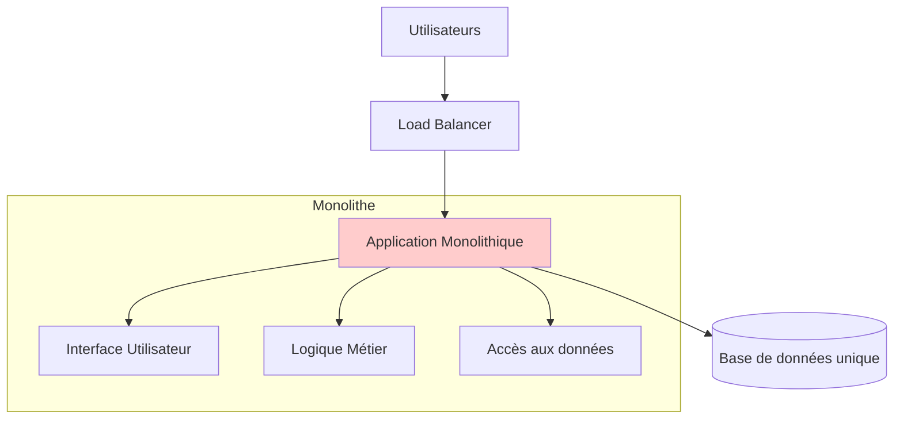
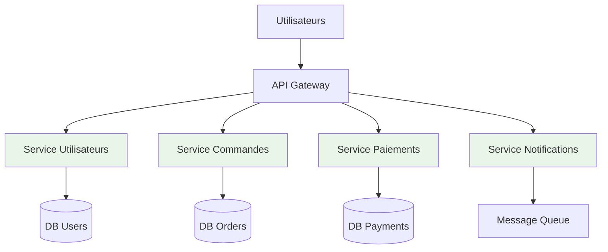
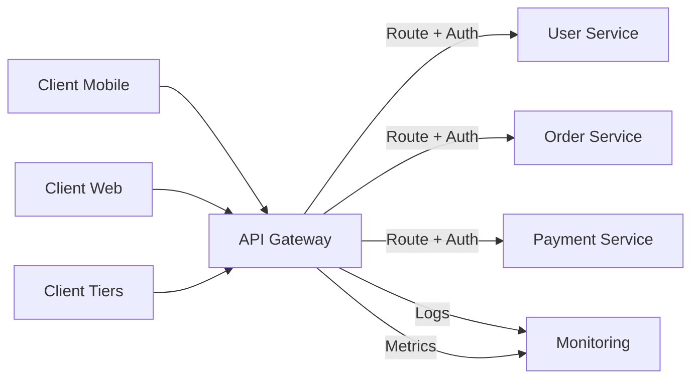
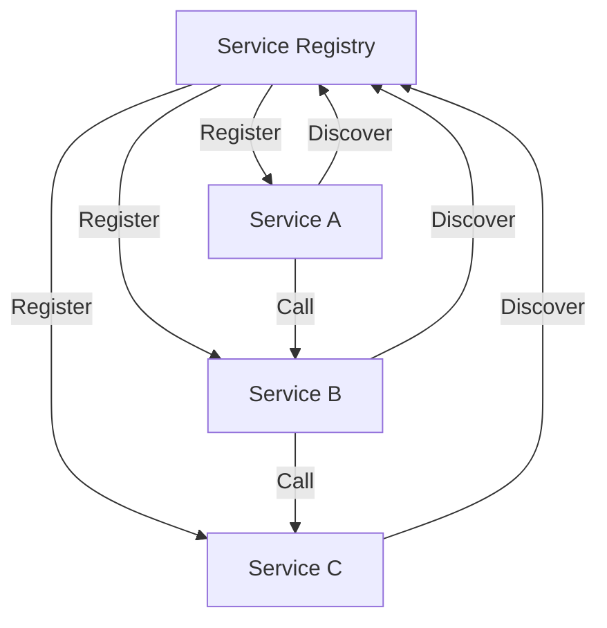
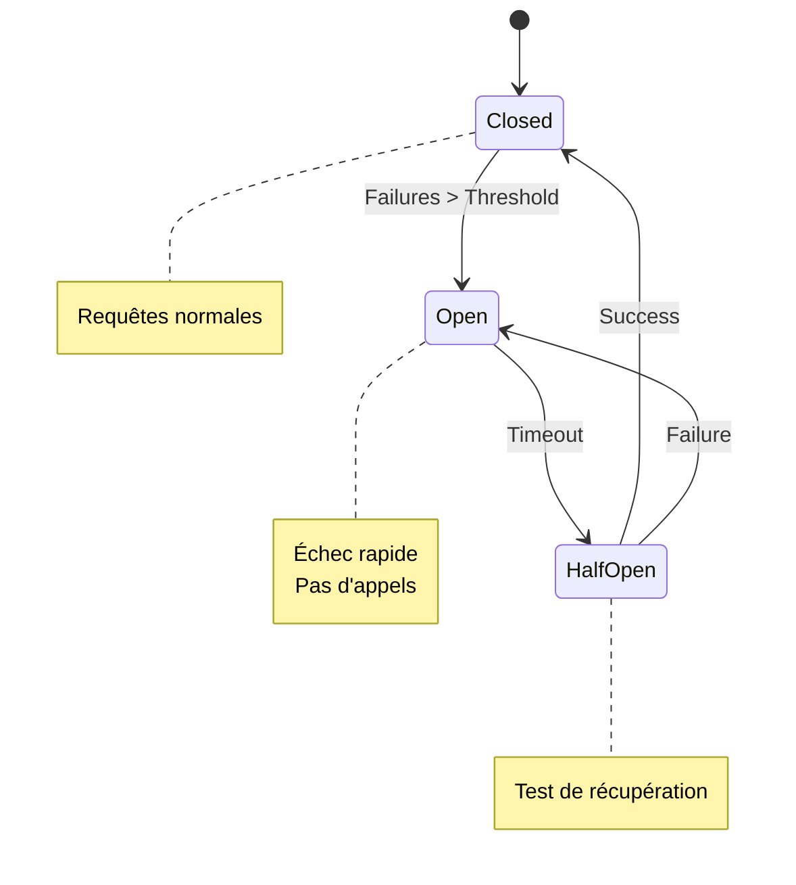
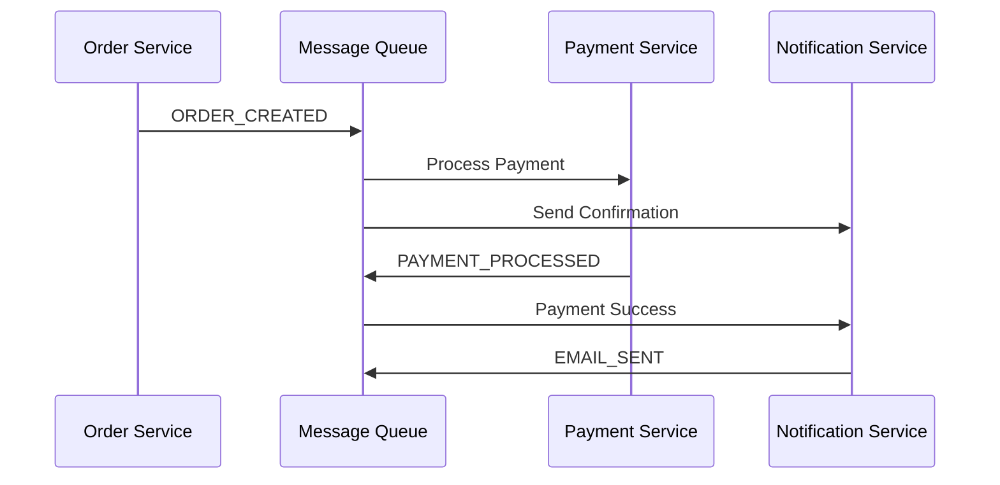
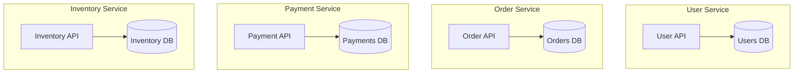
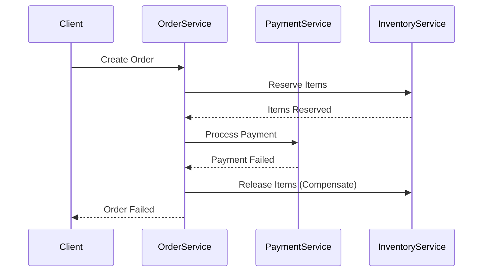
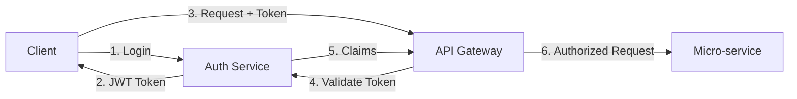
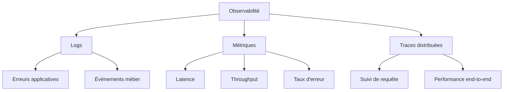

# Module 3 : Architecture Micro-services

## 📚 Objectifs pédagogiques

À la fin de ce module, vous serez capable de :
- Comprendre les principes de l'architecture micro-services
- Différencier architecture monolithique vs micro-services
- Identifier les avantages et défis des micro-services
- Concevoir une architecture micro-services simple
- Implémenter la communication entre micro-services
- Gérer la sécurité et la surveillance dans une architecture distribuée

---

## 🎯 Introduction

L'architecture micro-services est un style d'architecture qui structure une application comme un ensemble de **services indépendants** communiquant via des APIs bien définies.

**Analogie** : Imaginez une grande entreprise :
- **Monolithe** = Tous les employés dans un seul bureau géant
- **Micro-services** = Départements spécialisés (RH, Finance, IT) dans des bureaux séparés qui collaborent

**Définition** : Les micro-services décomposent une application complexe en petits services métier autonomes, déployables indépendamment.

---

## 🏗️ Monolithe vs Micro-services

### Architecture Monolithique



**Caractéristiques** :
- ✅ Simple à développer au début
- ✅ Facile à tester et déployer
- ❌ Devient complexe à grande échelle
- ❌ Technologie unique
- ❌ Déploiement en bloc

### Architecture Micro-services



**Caractéristiques** :
- ✅ Scalabilité indépendante
- ✅ Technologies diverses
- ✅ Équipes autonomes
- ❌ Complexité de communication
- ❌ Gestion distribuée

---

## 🔑 Principes fondamentaux

### 1. Responsabilité unique
Chaque service a une **responsabilité métier spécifique**.

### 2. Autonomie
Les services sont **développés, déployés et gérés indépendamment**.

### 3. Décentralisation
**Données et gouvernance** décentralisées par service.

### 4. Résistance aux pannes
**Conception défensive** face aux défaillances réseau.

### 5. Communication par APIs
**Interfaces contractuelles** bien définies.

---

## 🏛️ Patterns d'architecture

### API Gateway Pattern



**Responsabilités de l'API Gateway** :
- Routage des requêtes
- Authentification/Autorisation
- Limitation de débit (Rate limiting)
- Monitoring et logging
- Transformation des données

### Service Discovery Pattern



### Circuit Breaker Pattern



---

## 🚀 Communication entre services

### Communication Synchrone (REST APIs)

```javascript
// Service Commandes appelle Service Utilisateurs
class OrderService {
    async createOrder(userId, items) {
        try {
            // Vérifier l'utilisateur
            const user = await fetch(`http://user-service/users/${userId}`);
            if (!user.ok) throw new Error('User not found');
            
            // Créer la commande
            const order = {
                userId,
                items,
                createdAt: new Date()
            };
            
            return await this.saveOrder(order);
        } catch (error) {
            console.error('Order creation failed:', error);
            throw error;
        }
    }
}
```

### Communication Asynchrone (Messages)



```javascript
// Publisher (Service Commandes)
const publishEvent = (eventType, data) => {
    messageQueue.publish('orders.events', {
        type: eventType,
        data,
        timestamp: new Date()
    });
};

// Subscriber (Service Notifications)
messageQueue.subscribe('orders.events', (message) => {
    if (message.type === 'ORDER_CREATED') {
        sendOrderConfirmation(message.data);
    }
});
```

---

## 🗄️ Gestion des données

### Database per Service



### Saga Pattern (Transactions distribuées)



---

## 🔒 Sécurité dans les micro-services

### Authentication & Authorization



### Token-based Security (JWT)

```javascript
// Middleware d'authentification
const authenticateToken = (req, res, next) => {
    const authHeader = req.headers['authorization'];
    const token = authHeader && authHeader.split(' ')[1];
    
    if (!token) {
        return res.status(401).json({ error: 'Access token required' });
    }
    
    jwt.verify(token, process.env.JWT_SECRET, (err, user) => {
        if (err) return res.status(403).json({ error: 'Invalid token' });
        req.user = user;
        next();
    });
};

// Utilisation
app.get('/api/orders', authenticateToken, getOrders);
```

---

## 📊 Monitoring et Observabilité

### Les trois piliers de l'observabilité



### Exemple de logging structuré

```javascript
const logger = require('winston');

// Configuration du logger
const serviceLogger = logger.createLogger({
    level: 'info',
    format: logger.format.combine(
        logger.format.timestamp(),
        logger.format.json()
    ),
    defaultMeta: {
        service: 'order-service',
        version: '1.2.0'
    }
});

// Utilisation
serviceLogger.info('Order created', {
    orderId: '12345',
    userId: 'user-789',
    amount: 99.99,
    correlationId: req.headers['x-correlation-id']
});
```

---

## 🛠️ Outils et technologies

### Stack technologique typique

| Catégorie | Outils |
|-----------|--------|
| **Conteneurisation** | Docker, Kubernetes |
| **API Gateway** | Kong, AWS API Gateway, Zuul |
| **Service Mesh** | Istio, Linkerd, Consul Connect |
| **Base de données** | PostgreSQL, MongoDB, Redis |
| **Messaging** | RabbitMQ, Apache Kafka, AWS SQS |
| **Monitoring** | Prometheus, Grafana, ELK Stack |
| **Tracing** | Jaeger, Zipkin, AWS X-Ray |

---

## 📚 Ressources officielles

- [Microservices.io - Patterns](https://microservices.io/patterns/)
- [Martin Fowler on Microservices](https://martinfowler.com/articles/microservices.html)
- [12-Factor App Methodology](https://12factor.net/)
- [API Design Guidelines](https://github.com/microsoft/api-guidelines)
- [Kubernetes Documentation](https://kubernetes.io/docs/)

---

## 🎯 Exercices pratiques

### Exercice 1 : Conception d'architecture
**Contexte** : Système de e-commerce
1. Identifiez 5 domaines métier (services)
2. Définissez les responsabilités de chaque service
3. Dessinez l'architecture avec les communications
4. Identifiez les données de chaque service

### Exercice 2 : API REST pour micro-service
1. Créez un service "Products" avec Express.js
2. Implémentez les endpoints CRUD
3. Ajoutez la validation des données
4. Documentez l'API avec Swagger

### Exercice 3 : Communication entre services
1. Créez un service "Orders" 
2. Faites-le communiquer avec le service "Products"
3. Implémentez la gestion d'erreur
4. Ajoutez des logs structurés

### Exercice 4 : Messaging asynchrone
1. Configurez RabbitMQ avec Docker
2. Créez un publisher dans le service Orders
3. Créez un consumer dans un service Notifications
4. Testez l'envoi d'événements

---

## ✅ Points clés à retenir

- **Décomposition métier** : Un service = une responsabilité
- **Indépendance** : Services autonomes en développement et déploiement
- **Communication** : APIs REST + messaging asynchrone
- **Données** : Une base par service
- **Observabilité** : Logs, métriques, traces indispensables
- **Sécurité** : Authentification centralisée, autorisation distribuée

---

## ⚠️ Défis et considérations

1. **Complexité** : Plus difficile à déboguer
2. **Réseau** : Latence, partitions, indisponibilité
3. **Données** : Consistance éventuelle
4. **Tests** : Tests d'intégration complexes
5. **Déploiement** : Coordination des versions
6. **Monitoring** : Observabilité distribuée

---

*Prochaine étape : Module 4 - Workflow Intégré (CI/CD + Orchestration)* 