# Module 4 : Workflow Intégré - CI/CD & Orchestration

## 📚 Objectifs pédagogiques

À la fin de ce module, vous serez capable de :
- Comprendre les concepts de CI/CD (Intégration et Déploiement Continus)
- Mettre en place un pipeline CI/CD avec GitHub Actions
- Orchestrer des conteneurs avec Docker Compose et Kubernetes
- Automatiser les tests et déploiements
- Gérer les environnements de développement, staging et production
- Surveiller et maintenir vos applications en production

---

## 🎯 Introduction

Le **Workflow Intégré** combine Git, Docker et l'architecture micro-services dans un processus automatisé qui va du code source jusqu'à la production.

**Analogie** : Imaginez une chaîne de production automobile :
- **CI (Continuous Integration)** = Vérification qualité à chaque étape
- **CD (Continuous Delivery)** = Préparation automatique pour la livraison  
- **CD (Continuous Deployment)** = Livraison automatique au client

**Objectif** : Livrer des fonctionnalités rapidement, de manière fiable et sécurisée.

---

## 🔄 Concepts CI/CD

### Le pipeline DevOps

```mermaid
graph LR
    DEV[Développement] --> BUILD[Build]
    BUILD --> TEST[Tests]
    TEST --> DEPLOY[Déploiement]
    DEPLOY --> MONITOR[Monitoring]
    MONITOR --> DEV
    
    subgraph "CI - Continuous Integration"
        BUILD
        TEST
    end
    
    subgraph "CD - Continuous Delivery/Deployment"
        DEPLOY
        MONITOR
    end
```



### Workflow Git + CI/CD

```mermaid
gitgraph
    commit id: "Initial"
    branch develop
    checkout develop
    
    branch feature/user-auth
    checkout feature/user-auth
    commit id: "Add login"
    commit id: "Add tests"
    
    checkout develop
    merge feature/user-auth id: "PR Merged"
    
    commit id: "CI triggered" type: HIGHLIGHT
    commit id: "Tests pass" type: NORMAL
    commit id: "Build Docker" type: NORMAL
    commit id: "Deploy staging" type: HIGHLIGHT
    
    checkout main
    merge develop id: "Release v1.1"
    commit id: "Deploy prod" type: HIGHLIGHT
```

---

## 🏗️ Architecture du Workflow

### Vue d'ensemble de l'infrastructure


---

## 🔨 GitHub Actions - CI/CD Pipeline

### Structure d'un workflow

```yaml
# .github/workflows/ci-cd.yml
name: CI/CD Pipeline

on:
  push:
    branches: [ main, develop ]
  pull_request:
    branches: [ main ]

env:
  REGISTRY: ghcr.io
  IMAGE_NAME: ${{ github.repository }}

jobs:
  # Job 1: Tests et validation
  test:
    runs-on: ubuntu-latest
    steps:
      - name: Checkout code
        uses: actions/checkout@v3
      
      - name: Setup Node.js
        uses: actions/setup-node@v3
        with:
          node-version: '18'
          cache: 'npm'
      
      - name: Install dependencies
        run: npm ci
      
      - name: Run linting
        run: npm run lint
      
      - name: Run unit tests
        run: npm run test:unit
      
      - name: Run integration tests
        run: npm run test:integration

  # Job 2: Build et push Docker
  build:
    needs: test
    runs-on: ubuntu-latest
    outputs:
      image: ${{ steps.image.outputs.image }}
    steps:
      - name: Checkout code
        uses: actions/checkout@v3
      
      - name: Login to Container Registry
        uses: docker/login-action@v2
        with:
          registry: ${{ env.REGISTRY }}
          username: ${{ github.actor }}
          password: ${{ secrets.GITHUB_TOKEN }}
      
      - name: Build and push Docker image
        id: image
        run: |
          IMAGE_ID=${{ env.REGISTRY }}/${{ env.IMAGE_NAME }}
          IMAGE_ID=$(echo $IMAGE_ID | tr '[A-Z]' '[a-z]')
          VERSION=$(echo "${{ github.ref }}" | sed -e 's,.*/\(.*\),\1,')
          
          echo "Building $IMAGE_ID:$VERSION"
          docker build -t $IMAGE_ID:$VERSION .
          docker push $IMAGE_ID:$VERSION
          echo "image=$IMAGE_ID:$VERSION" >> $GITHUB_OUTPUT

  # Job 3: Déploiement staging
  deploy-staging:
    needs: build
    runs-on: ubuntu-latest
    if: github.ref == 'refs/heads/develop'
    environment: staging
    steps:
      - name: Deploy to staging
        run: |
          echo "Deploying ${{ needs.build.outputs.image }} to staging"
          # Commandes de déploiement

  # Job 4: Déploiement production
  deploy-prod:
    needs: build
    runs-on: ubuntu-latest
    if: github.ref == 'refs/heads/main'
    environment: production
    steps:
      - name: Deploy to production
        run: |
          echo "Deploying ${{ needs.build.outputs.image }} to production"
          # Commandes de déploiement
```

### Stratégies de déploiement


---

## 🐳 Orchestration avec Docker Compose

### Environnement multi-services

```yaml
# docker-compose.yml
version: '3.8'

services:
  # API Gateway
  api-gateway:
    build: ./api-gateway
    ports:
      - "80:3000"
    environment:
      - NODE_ENV=production
    depends_on:
      - user-service
      - order-service
    networks:
      - app-network

  # Service Utilisateurs
  user-service:
    build: ./user-service
    environment:
      - DB_HOST=user-db
      - DB_NAME=users
      - REDIS_URL=redis://redis:6379
    depends_on:
      - user-db
      - redis
    networks:
      - app-network

  # Service Commandes
  order-service:
    build: ./order-service
    environment:
      - DB_HOST=order-db
      - DB_NAME=orders
      - RABBITMQ_URL=amqp://rabbitmq:5672
    depends_on:
      - order-db
      - rabbitmq
    networks:
      - app-network

  # Bases de données
  user-db:
    image: postgres:13
    environment:
      POSTGRES_DB: users
      POSTGRES_USER: user
      POSTGRES_PASSWORD: password
    volumes:
      - user-data:/var/lib/postgresql/data
    networks:
      - app-network

  order-db:
    image: postgres:13
    environment:
      POSTGRES_DB: orders
      POSTGRES_USER: user
      POSTGRES_PASSWORD: password
    volumes:
      - order-data:/var/lib/postgresql/data
    networks:
      - app-network

  # Cache Redis
  redis:
    image: redis:7-alpine
    networks:
      - app-network

  # Message Queue
  rabbitmq:
    image: rabbitmq:3-management
    ports:
      - "15672:15672"
    networks:
      - app-network

  # Monitoring
  prometheus:
    image: prom/prometheus
    ports:
      - "9090:9090"
    volumes:
      - ./prometheus.yml:/etc/prometheus/prometheus.yml
    networks:
      - app-network

volumes:
  user-data:
  order-data:

networks:
  app-network:
    driver: bridge
```

### Scripts de gestion

```bash
#!/bin/bash
# deploy.sh - Script de déploiement

set -e

ENV=${1:-staging}
VERSION=${2:-latest}

echo "🚀 Déploiement en cours - Environnement: $ENV, Version: $VERSION"

# Arrêt des services existants
echo "⏹️  Arrêt des services..."
docker-compose -f docker-compose.yml -f docker-compose.$ENV.yml down

# Mise à jour des images
echo "📦 Téléchargement des nouvelles images..."
docker-compose -f docker-compose.yml -f docker-compose.$ENV.yml pull

# Démarrage des services
echo "▶️  Démarrage des services..."
docker-compose -f docker-compose.yml -f docker-compose.$ENV.yml up -d

# Vérification de santé
echo "🔍 Vérification de santé..."
sleep 30
curl -f http://localhost/health || exit 1

echo "✅ Déploiement réussi !"
```

---

## ☸️ Introduction à Kubernetes

### Architecture Kubernetes


### Déploiement Kubernetes basique

```yaml
# k8s/deployment.yml
apiVersion: apps/v1
kind: Deployment
metadata:
  name: user-service
  labels:
    app: user-service
spec:
  replicas: 3
  selector:
    matchLabels:
      app: user-service
  template:
    metadata:
      labels:
        app: user-service
    spec:
      containers:
      - name: user-service
        image: myregistry/user-service:1.2.0
        ports:
        - containerPort: 3000
        env:
        - name: DB_HOST
          value: "postgres-service"
        - name: DB_NAME
          value: "users"
        resources:
          requests:
            memory: "128Mi"
            cpu: "100m"
          limits:
            memory: "256Mi"
            cpu: "200m"
        livenessProbe:
          httpGet:
            path: /health
            port: 3000
          initialDelaySeconds: 30
          periodSeconds: 10
        readinessProbe:
          httpGet:
            path: /ready
            port: 3000
          initialDelaySeconds: 5
          periodSeconds: 5

---
# k8s/service.yml
apiVersion: v1
kind: Service
metadata:
  name: user-service
spec:
  selector:
    app: user-service
  ports:
  - protocol: TCP
    port: 80
    targetPort: 3000
  type: ClusterIP
```

### Commands Kubernetes essentielles

```bash
# Déploiement
kubectl apply -f k8s/

# Vérification des pods
kubectl get pods
kubectl describe pod user-service-xxx

# Logs
kubectl logs -f deployment/user-service

# Mise à l'échelle
kubectl scale deployment user-service --replicas=5

# Mise à jour rolling
kubectl set image deployment/user-service user-service=myregistry/user-service:1.3.0

# Port forwarding pour tests
kubectl port-forward service/user-service 3000:80
```

---

## 📊 Monitoring et Observabilité

### Stack de monitoring

```yaml
# monitoring/docker-compose.yml
version: '3.8'

services:
  # Collecte de métriques
  prometheus:
    image: prom/prometheus:latest
    ports:
      - "9090:9090"
    volumes:
      - ./prometheus.yml:/etc/prometheus/prometheus.yml
    command:
      - '--config.file=/etc/prometheus/prometheus.yml'
      - '--storage.tsdb.path=/prometheus'
      - '--web.console.libraries=/etc/prometheus/console_libraries'
      - '--web.console.templates=/etc/prometheus/consoles'

  # Visualisation
  grafana:
    image: grafana/grafana:latest
    ports:
      - "3000:3000"
    environment:
      - GF_SECURITY_ADMIN_PASSWORD=admin
    volumes:
      - grafana-data:/var/lib/grafana

  # Collecte de logs
  elasticsearch:
    image: elasticsearch:7.17.0
    environment:
      - discovery.type=single-node
      - "ES_JAVA_OPTS=-Xms512m -Xmx512m"

  logstash:
    image: logstash:7.17.0
    volumes:
      - ./logstash.conf:/usr/share/logstash/pipeline/logstash.conf

  kibana:
    image: kibana:7.17.0
    ports:
      - "5601:5601"
    environment:
      - ELASTICSEARCH_HOSTS=http://elasticsearch:9200

  # Tracing distribué
  jaeger:
    image: jaegertracing/all-in-one:latest
    ports:
      - "16686:16686"
      - "14268:14268"

volumes:
  grafana-data:
```

### Dashboard Grafana

```json
{
  "dashboard": {
    "title": "Microservices Monitoring",
    "panels": [
      {
        "title": "Request Rate",
        "targets": [
          {
            "expr": "rate(http_requests_total[5m])",
            "legendFormat": "{{service}}"
          }
        ]
      },
      {
        "title": "Response Time",
        "targets": [
          {
            "expr": "histogram_quantile(0.95, rate(http_request_duration_seconds_bucket[5m]))",
            "legendFormat": "95th percentile"
          }
        ]
      },
      {
        "title": "Error Rate",
        "targets": [
          {
            "expr": "rate(http_requests_total{status=~\"5..\"}[5m])",
            "legendFormat": "{{service}} errors"
          }
        ]
      }
    ]
  }
}
```

---

## 🔒 Sécurité et bonnes pratiques

### Secrets Management

```yaml
# k8s/secrets.yml
apiVersion: v1
kind: Secret
metadata:
  name: app-secrets
type: Opaque
data:
  database-password: <base64-encoded-password>
  jwt-secret: <base64-encoded-secret>

---
# Dans le deployment
spec:
  containers:
  - name: user-service
    env:
    - name: DB_PASSWORD
      valueFrom:
        secretKeyRef:
          name: app-secrets
          key: database-password
```

### Network Policies

```yaml
# k8s/network-policy.yml
apiVersion: networking.k8s.io/v1
kind: NetworkPolicy
metadata:
  name: user-service-policy
spec:
  podSelector:
    matchLabels:
      app: user-service
  policyTypes:
  - Ingress
  - Egress
  ingress:
  - from:
    - podSelector:
        matchLabels:
          app: api-gateway
    ports:
    - protocol: TCP
      port: 3000
  egress:
  - to:
    - podSelector:
        matchLabels:
          app: postgres
    ports:
    - protocol: TCP
      port: 5432
```

---

## 📚 Ressources officielles

- [GitHub Actions Documentation](https://docs.github.com/en/actions)
- [Docker Compose Documentation](https://docs.docker.com/compose/)
- [Kubernetes Documentation](https://kubernetes.io/docs/)
- [Prometheus Documentation](https://prometheus.io/docs/)
- [Grafana Documentation](https://grafana.com/docs/)
- [The Twelve-Factor App](https://12factor.net/)

---

## 🎯 Exercices pratiques

### Exercice 1 : Pipeline CI/CD basique
1. Créez un repository avec une application Node.js simple
2. Ajoutez des tests unitaires avec Jest
3. Configurez GitHub Actions pour :
   - Exécuter les tests sur chaque push
   - Builder une image Docker
   - Pousser l'image vers GitHub Container Registry

### Exercice 2 : Déploiement multi-environnements
1. Étendez le pipeline pour gérer staging et production
2. Configurez les secrets GitHub pour les credentials
3. Ajoutez une validation manuelle pour la production
4. Testez le déploiement automatique

### Exercice 3 : Orchestration avec Docker Compose
1. Créez une application micro-services (3 services minimum)
2. Écrivez un docker-compose.yml complet
3. Ajoutez une base de données et un cache Redis
4. Configurez un load balancer nginx

### Exercice 4 : Monitoring complet
1. Intégrez Prometheus dans votre application
2. Créez des métriques custom (compteurs, histogrammes)
3. Configurez Grafana avec des dashboards
4. Ajoutez des alertes sur les métriques critiques

### Exercice 5 : Déploiement Kubernetes
1. Convertissez votre Docker Compose en manifests Kubernetes
2. Déployez sur un cluster local (minikube/kind)
3. Configurez l'auto-scaling horizontal
4. Testez une mise à jour rolling

---

## ✅ Points clés à retenir

- **Automatisation** : Éliminer les tâches manuelles répétitives
- **Pipeline CI/CD** : Build → Test → Deploy automatisé
- **Environnements** : Développement → Staging → Production
- **Monitoring** : Observabilité indispensable en production
- **Sécurité** : Secrets, authentification, isolation réseau
- **Réversibilité** : Toujours pouvoir revenir en arrière

---

## 🚀 Stratégies avancées

### GitOps


### Infrastructure as Code
```yaml
# terraform/main.tf
resource "kubernetes_deployment" "app" {
  metadata {
    name = "my-app"
  }
  
  spec {
    replicas = 3
    
    selector {
      match_labels = {
        app = "my-app"
      }
    }
    
    template {
      metadata {
        labels = {
          app = "my-app"
        }
      }
      
      spec {
        container {
          image = "my-registry/my-app:${var.app_version}"
          name  = "my-app"
        }
      }
    }
  }
}
```

---

## 🎓 Conclusion du cours

Félicitations ! Vous avez maintenant une vision complète du workflow moderne de développement :

1. **Git & GitFlow** - Versioning et collaboration
2. **Docker** - Conteneurisation et portabilité  
3. **Micro-services** - Architecture distribuée et scalable
4. **CI/CD** - Automatisation et déploiement continu

**Prochaines étapes recommandées** :
- Pratiquez sur des projets personnels
- Explorez Kubernetes en profondeur
- Apprenez l'Infrastructure as Code (Terraform)
- Maîtrisez les outils de monitoring avancés
- Étudiez les patterns de sécurité cloud-native

*Bonne route dans votre parcours DevOps ! 🚀* 