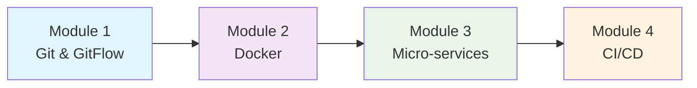
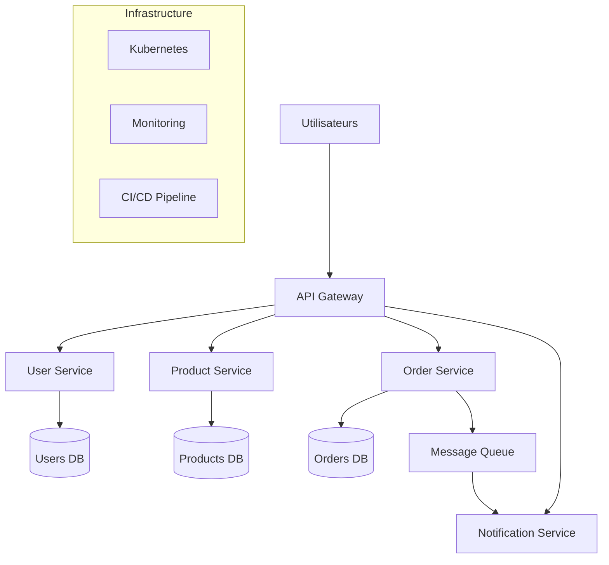

# 🚀 Introduction à Git, Docker et Architecture Micro-services

## 📋 Présentation du cours

Ce cours d'introduction vous accompagne dans l'apprentissage des technologies fondamentales du développement moderne :
- **Versioning** avec Git et GitFlow
- **Conteneurisation** avec Docker
- **Architecture Micro-services**
- **CI/CD et Orchestration**

**Public cible** : Étudiants débutants en développement web et mobile, sans connaissance préalable requise.


---

## 🗂️ Structure du cours

Le cours est organisé en **4 modules indépendants**, chacun pouvant être étudié séparément :

### Module 1 : [Git & GitFlow](./01-git-gitflow.md) 📝
- Concepts du versioning et contrôle de version
- Commandes Git essentielles
- Méthodologie GitFlow pour le travail en équipe
- Gestion des branches et résolution des conflits

### Module 2 : [Docker](./02-docker.md) 🐳
- Conteneurisation vs virtualisation
- Création et gestion des conteneurs
- Écriture de Dockerfiles
- Orchestration avec Docker Compose

### Module 3 : [Architecture Micro-services](./03-architecture-microservices.md) 🏗️
- Principes de l'architecture distribuée
- Communication entre services
- Patterns d'architecture (API Gateway, Circuit Breaker)
- Gestion des données et sécurité

### Module 4 : [Workflow Intégré - CI/CD](./04-workflow-integre-cicd.md) ⚙️
- Pipelines CI/CD avec GitHub Actions
- Déploiement multi-environnements
- Orchestration Kubernetes
- Monitoring et observabilité

---

## 🎯 Objectifs pédagogiques globaux

À la fin de ce cours, vous serez capable de :

1. **Maîtriser Git** pour versionner et collaborer sur vos projets
2. **Conteneuriser vos applications** avec Docker pour une portabilité maximale
3. **Concevoir des architectures micro-services** scalables et maintenables
4. **Mettre en place des pipelines CI/CD** pour automatiser vos déploiements
5. **Orchestrer et surveiller** vos applications en production

---

## 📚 Comment utiliser ce cours

### Prérequis
- Connaissances de base en programmation (n'importe quel langage)
- Un ordinateur avec des droits d'administration
- Motivation à apprendre ! 🚀

### Approche pédagogique
Chaque module suit la même structure :
- 📖 **Introduction** et objectifs clairs
- 🔑 **Concepts fondamentaux** expliqués simplement
- 🛠️ **Commandes et code** détaillés ligne par ligne
- 📊 **Diagrammes visuels** pour comprendre les architectures
- 🎯 **Exercices pratiques** pour valider les acquis
- 📚 **Ressources officielles** pour approfondir

### Parcours recommandé



**Option 1 - Parcours complet** : Suivez les modules dans l'ordre (recommandé)
**Option 2 - Parcours à la carte** : Choisissez les modules selon vos besoins

---

## 🛠️ Installation des outils

### Git
```bash
# Linux (Ubuntu/Debian)
sudo apt install git

# macOS
brew install git

# Windows
# Téléchargez depuis https://git-scm.com/
```

### Docker
```bash
# Linux
curl -fsSL https://get.docker.com -o get-docker.sh
sh get-docker.sh

# macOS/Windows
# Installez Docker Desktop depuis https://docker.com/
```

### Éditeur de code recommandé
- [Visual Studio Code](https://code.visualstudio.com/) avec les extensions :
  - Git Graph
  - Docker
  - Kubernetes
  - GitLens

---

## 🎯 Projet fil rouge

Tout au long du cours, nous construirons ensemble une **application e-commerce micro-services** :

### Architecture finale


### Technologies utilisées
- **Backend** : Node.js / Express
- **Base de données** : PostgreSQL, Redis
- **Messaging** : RabbitMQ
- **Monitoring** : Prometheus, Grafana
- **Orchestration** : Kubernetes
- **CI/CD** : GitHub Actions

---

## 📊 Évaluation des acquis

### Auto-évaluation par module
Chaque module contient des exercices pratiques pour valider vos acquis :
- ✅ Exercices guidés pas à pas
- ✅ Projets pratiques
- ✅ QCM de vérification
- ✅ Check-lists de compétences

### Projet final
Créez votre propre application micro-services en appliquant tous les concepts appris :
1. Architecture et conception
2. Développement des services
3. Conteneurisation Docker
4. Pipeline CI/CD
5. Déploiement en production

---

## 🤝 Aide et support

### Ressources officielles
- [Git Documentation](https://git-scm.com/doc)
- [Docker Documentation](https://docs.docker.com/)
- [Kubernetes Documentation](https://kubernetes.io/docs/)
- [GitHub Actions](https://docs.github.com/en/actions)

### Communautés
- [Stack Overflow](https://stackoverflow.com/) pour les questions techniques
- [Dev.to](https://dev.to/) pour les articles et tutoriels
- [Reddit DevOps](https://reddit.com/r/devops) pour les discussions

### Dépannage courant
Consultez la section **Troubleshooting** de chaque module pour les problèmes fréquents.

---

## 🎓 Certification et suite du parcours

### Après ce cours
Vous aurez les bases solides pour :
- Contribuer à des projets open source
- Rejoindre une équipe de développement
- Approfondir DevOps et Cloud
- Préparer des certifications professionnelles

### Certifications recommandées
- **Docker** : Docker Certified Associate (DCA)
- **Kubernetes** : Certified Kubernetes Application Developer (CKAD)
- **Cloud** : AWS/Azure/GCP Associate certifications
- **DevOps** : GitLab Certified DevOps Professional

---

## 📝 Notes importantes

### Version du cours
- **Version** : 1.0
- **Dernière mise à jour** : Janvier 2025
- **Compatibilité** : Docker 24+, Kubernetes 1.28+, Git 2.30+

### Contributions
Ce cours est en évolution constante. N'hésitez pas à :
- Signaler des erreurs
- Proposer des améliorations
- Partager vos retours d'expérience

---

## 🚀 Commencez votre parcours !

**Prêt à devenir un développeur DevOps ?**

👉 [Commencez par le Module 1 - Git & GitFlow](./01-git-gitflow.md)

---

*Bon apprentissage et bonne route dans le monde fascinant du développement moderne ! 🎯*

---

## 📄 Licence

Ce cours est distribué sous licence Creative Commons Attribution 4.0 International.
Vous êtes libre de :
- Partager et adapter le contenu
- L'utiliser à des fins commerciales ou non
- Créditer l'auteur original 